class: center, middle
background-image: url(img/monkey-tools.jpeg)

.dark-bubble[
# Tools in the Shed

.center[Data Modeling in TypeScript]
]

---

# Agenda

.large[
1. Introduction
2. What are data structures?
3. Built-in data structures
4. Other useful data structures
5. Why Types are cool
6. Representing state with Types
]

???

TypeScript built in data structures including Arrays, Sets, and Maps.
Other useful data structures including Queues, Linked Lists, and Graphs.

---

class: center, middle
background-image: url(img/soda-monkey.jpg)

.dark-bubble[
# Let's get down to business
]

---

# Introduction

.quote[
  _Bad programmers worry about the code. Good programmers worry about data structures and their relationships._

  .sig[ **Linus Torvalds** ]
]

.quote[
  _Smart data structures and dumb code works a lot better than the other way around._

  .sig[ **Eric S. Raymond** ]
]

.quote[
  _Data dominates. If you've chosen the right data structures and organized things well, the algorithms will almost always be self-evident. Data structures, not algorithms, are central to programming._

  .sig[ **Rob Pike** ]
]

???

Linus Torvalds - Best known as the maintainer and main developer of the Linux kernel and the creator of Git (and for having a bit of a temper).

Eric S Raymond - Author of "The Cathedral and the Bazaar", a foundational text on open source software, co-founder of the Open Source Initiative, author of "The Art of Unix Programming".

Rob Pike - One of the designers of the Go programming language, co-creator of UTF-8, worked at both Google and Bell Labs.

---

# What are data structures?

- A data structure is a collection of data values, the relationships among them, **and** the functions or operations that can be applied to the data. - Wikipedia
- Primitive data structures are just primitive types: numbers, characters, boolean values, etc.
- Complex data structures house one or more primitive values and their relationships.

.center.scaled.height3[
  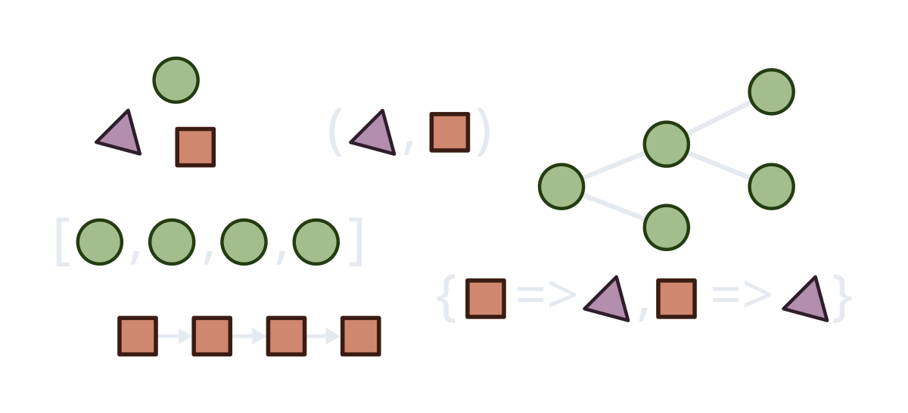
]

---

# A note about TypeScript

.height6[
.center[Types give us more tools for organizing our data while protecting us from the increasing complexity of more useful operations and data structures.]
]

--

.height5[
.quote[
  _A type system is the most cost effective unit test you’ll ever have._

  .sig[ **Peter Hallam** ]
]
]

???

Peter Hallam was a language designer on the first three versions of C#, then became technical lead for the C# compiler before moving to Google and building the Traceur compiler which compiles JavaScript.next to standard JavaScript.

--

.center[
  [Domain Driven Design with the F# Type System - Scott Wlaschin](https://www.slideshare.net/ScottWlaschin/ddd-with-fsharptypesystemlondonndc2013)
]

---

class: center, middle
background-image: url(img/monkey-with-orange.jpg)

.dark-bubble[
# What comes in the box?
]

---

# Built-in data structures

.flex[
.flex2[
## Primitives

- `number`
- `bigint`
- `boolean`
- `null`
- `undefined`
- `symbol`

## Complex Primitives

- `string`
- `any`.red.bold[*]
]

.flex2[
## Complex Types

- Enum.red.bold[*]
- Array/TypedArray
- Set/WeakSet
- Map/WeakMap
- Object (Record)
]
]

.height5.flex.flex-column-reverse[
.footnote.bottom[.red.bold[*] TypeScript Only]
]

---

class: center, middle
background-image: url(img/monkey-stack.jpg)

.dark-bubble[
# Stacks!
]

---

# Arrays and Stacks

.flex.height2[
.flex2.scaled[
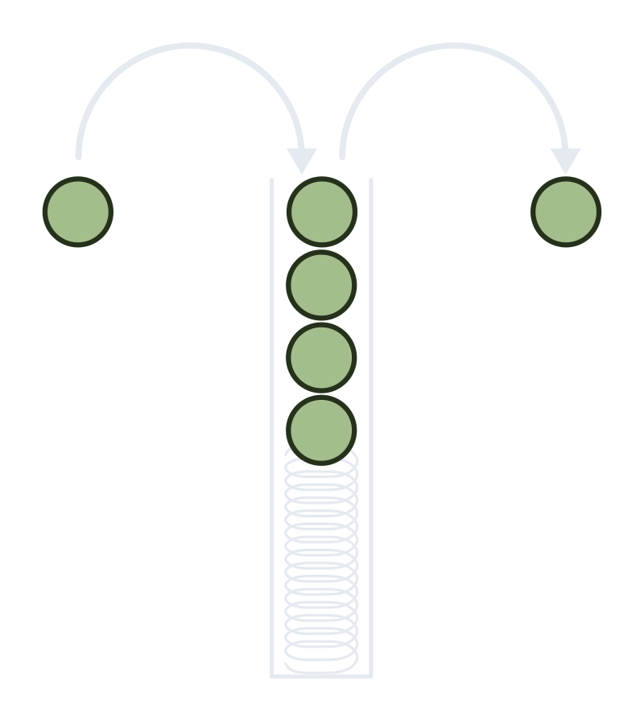
]

.flex2[
Stack

- Adding an item to the top of a stack is an O(1) operation.
- Removing an item from the top of the stack is an O(1) operation.

Array

- Viewing any item is an O(1) operation.
- Adding an item to the beginning of an Array is an O(n) operation.
- Removing an item from the beginning of an Array is an O(n) operation.
]
]

---

# Arrays and Stacks

.flex.height2[
.flex2.scaled[

]

.flex2[

```typescript
function matchBracket(l: string, r: string): boolean {
  if (l === "{" && r === "}") return true;
  if (l === "[" && r === "]") return true;
  if (l === "(" && r === ")") return true;
  return false;
}

function findUnpairedBrackets(str: string): number[] {
* let stack: string[] = [];
  let unpaired: number[] = [];

  for (let i = 0; i < str.length; i++) {
    let c = str.charAt(i);
    if (["{", "[", "("].includes(c)) stack.push(c);
    if (["}", "]", ")"].includes(c)) {
      let left = stack.pop();
      if (left === undefined) continue;
      if (!matchBracket(left, c)) {
        unpaired.push(i);
        stack.push(left);
      }
    } 
  }

  return unpaired;
}
```
]
]

---

class: center, middle
background-image: url(img/mandrill.jpg)

.dark-bubble[
# Sets Are For Unique Values
]

---

# Sets Are For Unique Values

.quote[
The `Set` object lets you store unique values of any type, whether primitive values or object references.

.sig[ MDN Reference ]
]

- Insertion into a `Set` is an O(1) operation, though slower than `.push()`ing to an `Array`.
- Iterating over a `Set` is an O(n) operation, still slower than iterating over an `Array`.
- Removing a specific item from a `Set` is an O(1) operation, _much_ faster than `splice()`ing an item out of an Array.
- `Set`s store _unique_ items, which makes them really handy for de-duplicating items. Important to note, though, that JS considers `Object`s with the same data to still be unique.
- Because of the uniqueness constraint, `Set`s can implement 'set' operations like union, intersection, differentiation, etc. much more efficiently than an `Array`.

---

# Set operations

.subtitle.center[Frank and Diane]

.height2.scaled[
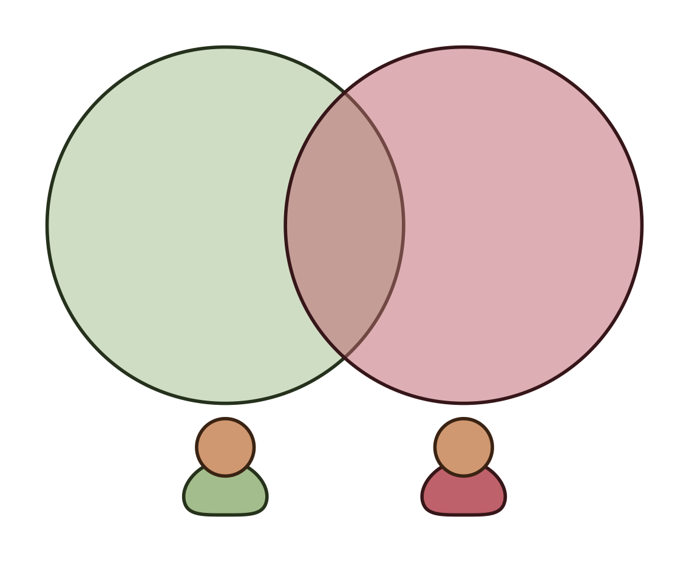
]

---

# Set operations

.subtitle.center[Union]

.height2.scaled[
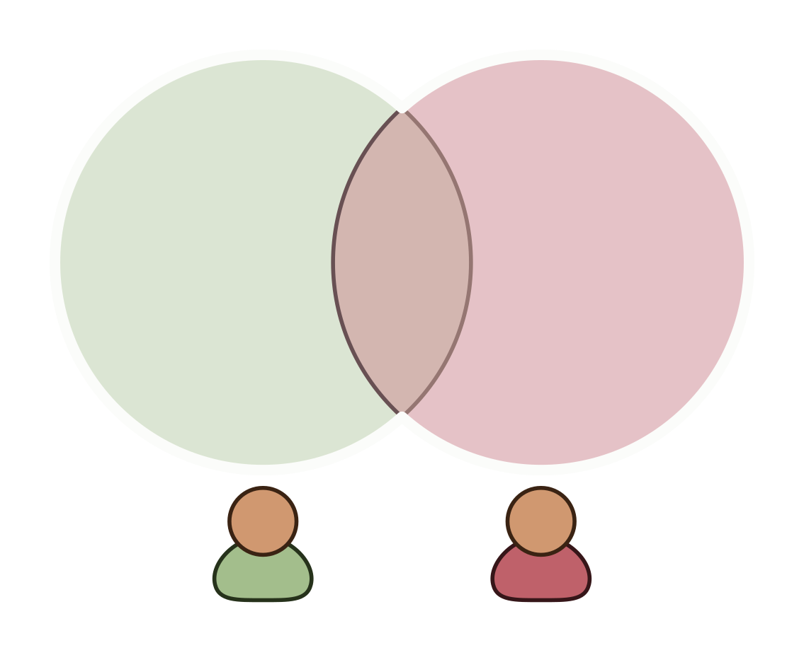
]

---

# Set operations

.subtitle.center[Union]

.height3.flex[
.flex2[
```typescript
// Union using `Array`s only

function arrayUnion(a: Person[], b: Person[]) {
  let total = 0;
  let everyone = [...a, ...b];
  everyone.forEach((person, index) => {
    let firstOne = everyone.findIndex(
        (p) => p.id == person.id
    );
    if (firstOne === index) total++;
  })
  return total;
}
```
]
.flex2[
```typescript
// Union using `Set`s

function setUnion(a: Person[], b: Person[]) {
  let unionSet = new Set<number>();
  a.forEach(person => unionSet.add(person.id));
  b.forEach(person => unionSet.add(person.id));
  return unionSet.size;
}
```
]
]

.divider.divider-v2[]

--

.flex[
.flex2[
- Time Complexity: O(n*m)
- Time to complete (10k): 321 ms
]
.flex2[
- Time Complexity: O(n+m)
- Time to complete (10k): 3.25 ms
]
]


---

# Set operations

.subtitle.center[Intersection]

.height2.scaled[
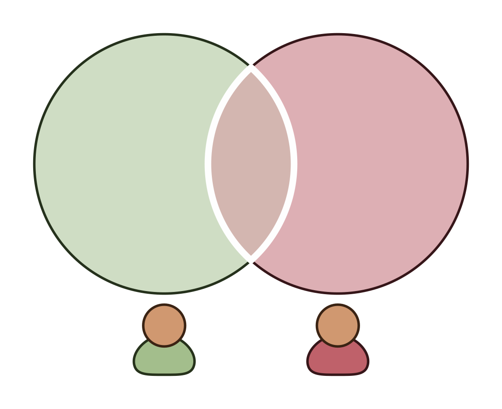
]

---

# Set operations

.subtitle.center[Intersection]

.height3.flex[
.flex2[
```typescript
// Intersection using `Array`s only

function arrayIntersection(a: Person[], b: Person[]) {
  let total = 0;
  for (let person of a) {
    if (b.some(p => p.id === person.id)) total++
  }
  return total;
} 
```
]
.flex2[
```typescript
// Intersection using `Set`s

function setIntersection(a: Person[], b: Person[]) {
  let total = 0;
  let aSet = new Set<number>();
  a.forEach(person => aSet.add(person.id));
  b.forEach(person => { 
      if (aSet.has(person.id)) total++ 
  });
  return total;
} 
```
]
]

.divider.divider-v2[]

--

.flex[
.flex2[
- Time Complexity: O(n*m)
- Time to complete (10k): 1127 ms
]
.flex2[
- Time Complexity: O(n+m)
- Time to complete (10k): 2.68 ms
]
]

---

# Set operations

.subtitle.center[Exclusion]

.height2.scaled[
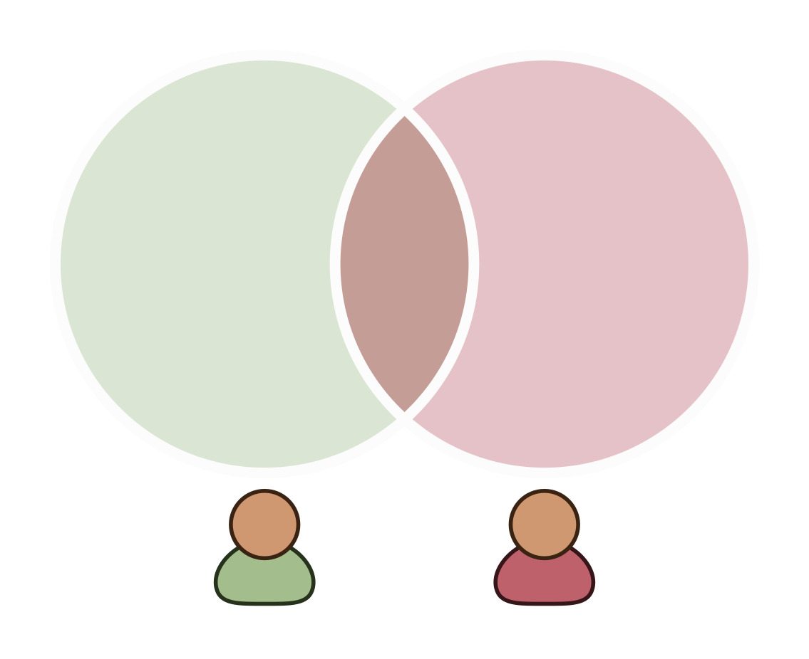
]

---

# Set operations

.subtitle.center[Exclusion]

.height3.flex[
.flex2[
```typescript
// Exclusion using `Array`s only

function arrayExclusion(a: Person[], b: Person[]) {
  let total = a.length + b.length;
  for (let person of a) {
    if (b.some(p => p.id === person.id)) {
      total = total - 2 
    } 
  }
  return total;
} 
```
]
.flex2[
```typescript
// Exclusion using `Set`s

function setExclusion(a: Person[], b: Person[]) {
  let total = a.length + b.length;
  let aSet = new Set<number>();
  a.forEach(person => aSet.add(person.id));
  b.forEach(person => { 
    if (aSet.has(person.id)) total = total - 2 
  });
  return total;
} 
```
]
]

.divider.divider-v2[]

--

.flex[
.flex2[
- Time Complexity: O(n*m)
- Time to complete (10k): 1107 ms
]
.flex2[
- Time Complexity: O(n+m)
- Time to complete (10k): 2.75 ms
]
]

---

# Set operations

.subtitle.center[Difference]

.height2.scaled[
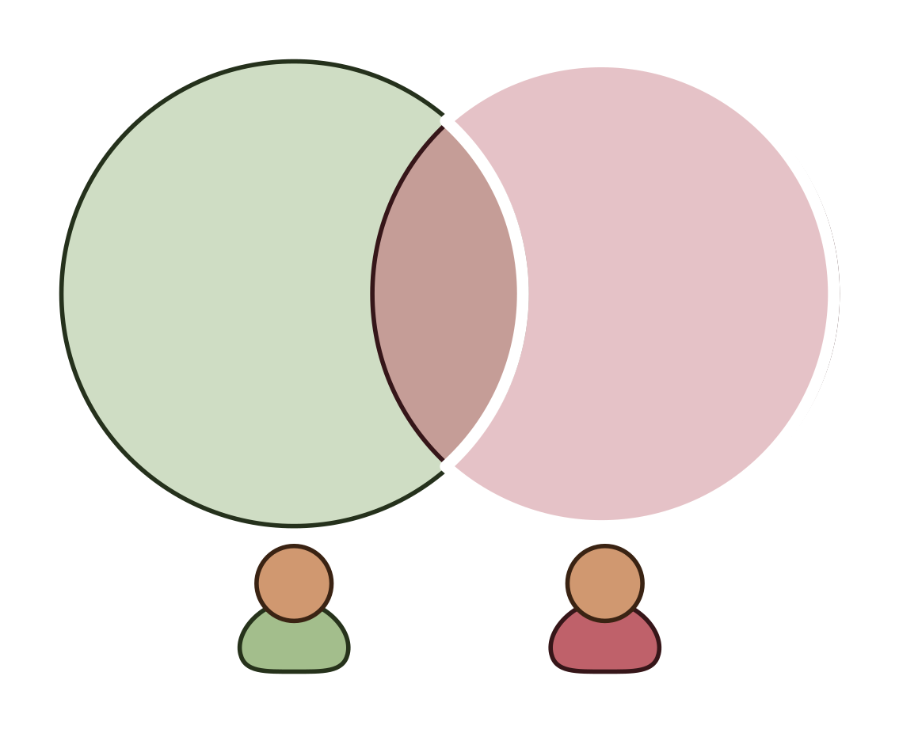
]

---

# Set operations

.subtitle.center[Difference]

.height3.flex[
.flex2[
```typescript
// Difference using `Array`s only

function arrayDifference(a: Person[], b: Person[]) {
  let total = a.length;
  for (let person of a) {
    if (b.some(p => p.id === person.id)) {
      total = total - 1 
    } 
  }
  return total;
} 
```
]
.flex2[
```typescript
// Difference using `Set`s

function setDifference(a: Person[], b: Person[]) {
  let total = a.length;
  let aSet = new Set<number>();
  a.forEach(person => aSet.add(person.id));
  b.forEach(person => { 
    if (aSet.has(person.id)) total = total - 1
  });
  return total;
} 
```
]
]

.divider.divider-v2[]

--

.flex[
.flex2[
- Time Complexity: O(n*m)
- Time to complete (10k): 1100 ms
]
.flex2[
- Time Complexity: O(n+m)
- Time to complete (10k): 2.51 ms
]
]

---

class: center, middle
background-image: url(img/monkey-flower.jpg)

.dark-bubble[
# Maps and Map-like Things
]

---

# Maps, WeakMaps, and Objects

|                    | Map                    | WeakMap                | Object                 |
|--------------------|------------------------|------------------------|------------------------|
| Keys               | Any type               | Only objects           | `string` or `symbol`   |
| Check for Key      | `Map.has()`            | `WeakMap.has()`        | `Object.hasProperty()` |
| Iteration          | In order               | None                   | Not in order           |
| Size               | Stored as an attribute | Unavailable            | Manually tracked       |
| Garbage Collection | Keys are protected     | Keys are not protected | Keys are protected     |

.height5.flex.flex-column-reverse[
1. .footnote.bottom[[Map vs WeakMap](https://www.tutorialspoint.com/what-is-the-difference-between-map-and-weakmap-in-javascript)]
2. .footnote.bottom[[WeakMap Reference](https://developer.mozilla.org/en-US/docs/Web/JavaScript/Reference/Global_Objects/WeakMap)]
3. .footnote.bottom[[Object Reference](https://developer.mozilla.org/en-US/docs/Web/JavaScript/Reference/Global_Objects/Object)]
4. .footnote.bottom[[Map vs Object](https://www.frontendmayhem.com/objects-vs-maps/)]
]

???

Maps, WeakMaps, and Objects are similar in that they all store key/value pairs, but each is specialized for its own use case.
  
Review the table...

So, the use cases for Maps and Objects seems pretty straightforward, but what about WeakMaps? In general, these are used to attach additional data to Objects where the Objects themselves may go away and you don't want to hold on to them for the life of the `Map` (your only other option). Not the most common use case, but an important one if you need it.

---

# Most Frequent Name

.height3.flex[
.flex2[
```typescript
type Pet = {
  id: number;
  name: string;
}

let pets = [
  {id: 1,  name: "Fido"},
  {id: 2,  name: "Fifi"},
  {id: 3,  name: "Fido"},
  {id: 4,  name: "Rex"},
  {id: 5,  name: "Snuffalupagus"},
  {id: 6,  name: "Dingo"},
  {id: 7,  name: "Fido"},
  {id: 8,  name: "Rex"},
  {id: 9,  name: "Ruffles"},
  {id: 10, name: "Fluffington"},
  {id: 11, name: "Jack"},
  {id: 12, name: "Fido"},
  {id: 13, name: "Charles Barksley"},
  {id: 14, name: "Nugget"},
  {id: 15, name: "Fido"},
  {id: 16, name: "Rex"},
  {id: 17, name: "Ruffles"},
  {id: 18, name: "T-Bone"},
  {id: 19, name: "Biscuit"}
]
```
]
.flex2[
```typescript
function mostCommonName(pets: Pet[]) {
  let nameCounts = new Map<string,number>();
  let maxCount   = 0;

  // Count name occurrences
  pets.forEach((pet) => {
    let current = nameCounts.get(pet.name);
    if (current === undefined) {
      nameCounts.set(pet.name, 1);
    } else {
      nameCounts.set(pet.name, current + 1);
      maxCount = Math.max(maxCount, current + 1);
    }
  });

  // Return the most common
  for (let entry of nameCounts.entries()) {
    if (entry[1] === maxCount) return entry[0];
  }
  throw new Error("No names provided!");
}
```
]
]

---

class: center, middle
background-image: url(img/smoll-monkey.jpg)

.dark-bubble[
# But Wait, There's More!
]

---

# Other useful data structures

.flex.flex-column[

.flex[
.flex2.center.middle.margin-auto[
.huge[Queue]
]
.flex2.pad0-inner.margin0-inner[
.block.scaled.height6[ 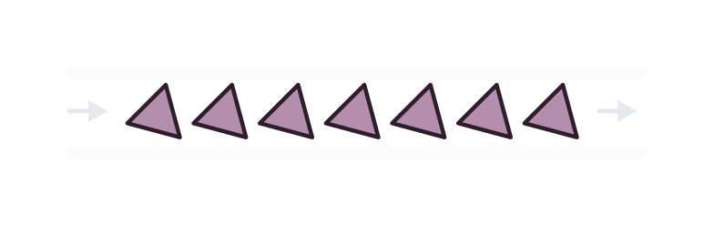]
]
]

.flex[
.flex2.center.middle.margin-auto[
.huge.middle[Linked List]
]
.flex2.pad0-inner.margin0-inner[
.block.scaled.height6[ 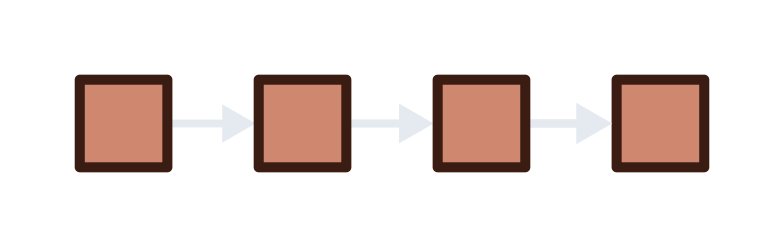]
]
]

.flex[
.flex2.center.middle.margin-auto[
.huge[Graph]
]
.flex2.pad0-inner.margin0-inner[
.block.scaled.height6[ 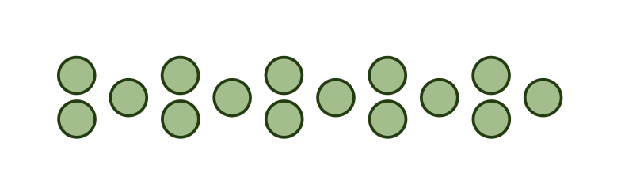]
]
]

]

---

class: center, middle
background-image: url(img/monkey-queue.jpg)

.dark-bubble[
# Queue
]

---

# The Queue

.flex.flex-column[
.block.flex2.center[  ]

.flex2[
- Adding an item to the 'front' is O(1)
- Removing an item from the 'back' is O(1)
- Accessing a single item is O(n)
]
]

---

# Web Crawler

.flex[
.flex2.small[
```typescript
import { Queue } from "queue-typescript";

type Page = {
  url: string;
  mimeType: string;
  links: Page[];
}

function getLinks(url: string): Page[] { ... }

function crawlPage(url: string): Page {
  let mainPage = { url, mimeType: "text/html", links: [] };
* let pageQueue = new Queue<Page>(mainPage);

  while (pageQueue.length) {
    let current = pageQueue.dequeue();
    if (current.mimeType !== "text/html") continue;
    let linkedPages = getLinks(current.url);
    
    for (let page of linkedPages) {
      current.links.push(page);
      pageQueue.enqueue(page);
    }
  }

  return mainPage;
}
```
]

.flex2[
```
{
  "url": "http://example.com",
  "mimeType": "text/html",
  "links": [
    {
      "url": "http://example.com/pdf-file",
      "mimeType": "application/pdf",
      "links": []
    },
    {
      "url": "http://example.com/audio-file",
      "mimeType": "audio/mpeg",
      "links": []
    },
    {
      "url": "http://example.com/bmp-image",
      "mimeType": "image/bmp",
      "links": []
    }
  ]
}
```
]
]

---

class: center, middle
background-image: url(img/monkey-linked-list.jpg)

.dark-bubble[
# Linked List
]

---

# Linked List

.flex.flex-column[
.block.flex2.center[  ]
.flex2[
- O(1) insertions and removals at either end
- O(n) insertions and removals in the middle
- O(n) access for middle elements
]
]

---

# Linked List

.flex.flex-column[
.block.flex2.center[  ]
.block.flex2.center.huge[ It's the data structure underlying the Queue ]
]

???

So, if a Linked List basically combines the benefits of a Stack and a Queue into a single data structure, why not use it for everything? (instead of Arrays). The answer: read-heavy workflows.

---

# Linked List

.flex[
.flex2.small[
```typescript
import { LinkedList } from "linked-list-typescript";

type ArrayOrLinkedList<T> = Array<T> | LinkedList<T>

function addToFront<T>(ds: ArrayOrLinkedList<T>, value: T) {
  if (ds instanceof LinkedList) {
    ds.append(value);
  } else {
    ds.push(value);
  }
}

function addToBack<T>(ds: ArrayOrLinkedList<T>, value: T) {
  if (ds instanceof LinkedList) {
    ds.prepend(value);
  } else {
    ds.unshift(value);
  }
}
```
]

.flex2.small[
```typescript
function stressTest(ds: ArrayOrLinkedList<number>) {
  let t0 = performance.now();
  for (let i = 0; i < 100000; i++) {
    addToFront(ds, i);
    addToBack(ds, i);
  }
  let t1 = performance.now();
  for (let round = 0; round < 100; round++) {
    let total = 0;
    for (let value of ds) {
      total += value;
    }
  }
  let t2 = performance.now();
  console.log(`200k insertions in ${t1 - t0} milliseconds`);
  console.log(`100 summations in ${t2 - t1} milliseconds`);
}
```
]
]

--

.center[
```
Stress test for Arrays:
200k insertions in 2967.6350079998374 milliseconds
100 summations in 71.7453279979527 milliseconds

Stress test for LinkedLists:
200k insertions in 26.358474999666214 milliseconds
100 summations in 711.8602069988847 milliseconds
```
]

---

class: center, middle
background-image: url(img/monkey-graph.jpg)

.dark-bubble[
# Moar Nodes!
]

---

# Graphs

.center[
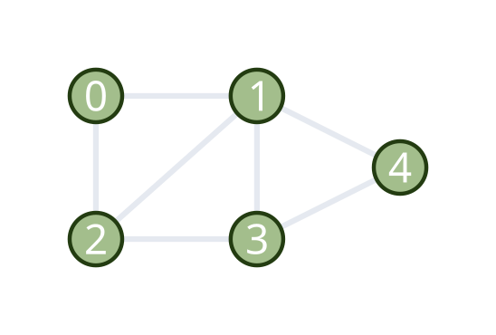
]

A graph has:
- Nodes: The vertices, or items, in the graph
- Edges: The connections between Nodes

---

# Graph Representations

.flex[
.flex2[
.center.large[Adjacency Matrix]
.scaled.center[ 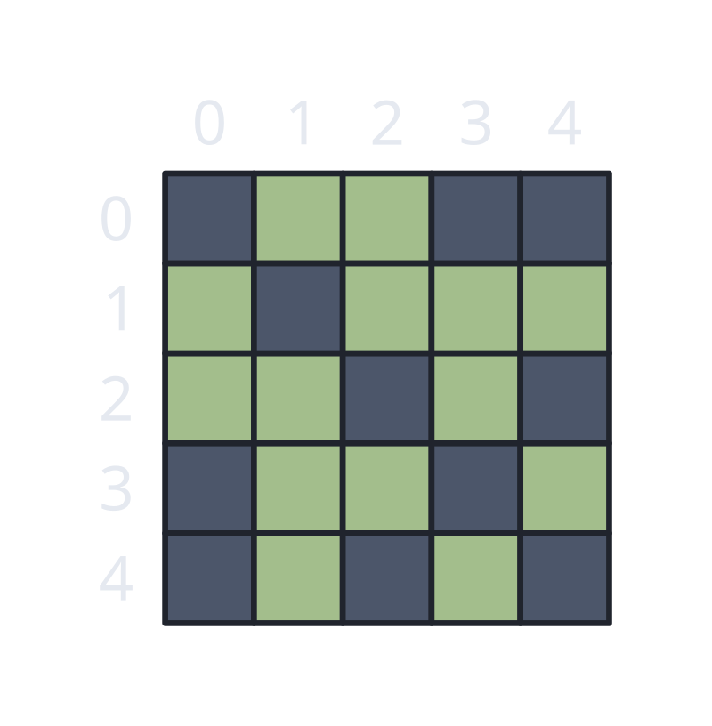 ]
]
.flex2[
.center.large[Adjacency List]
.scaled.center[ 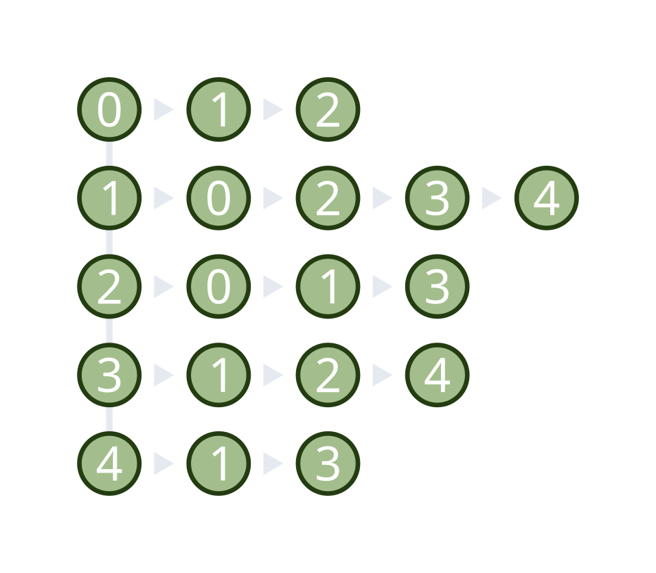 ]
]
]

---

# Remember Me?

.flex[
.flex2.small[
```typescript
type Page = {
  url: string;
  mimeType: string;
  links: Page[];
}
```
```
{
  "url": "http://example.com",
  "mimeType": "text/html",
  "links": [
    {
      "url": "http://example.com/pdf-file",
      "mimeType": "application/pdf",
      "links": []
    },
    {
      "url": "http://example.com/audio-file",
      "mimeType": "audio/mpeg",
      "links": []
    },
    {
      "url": "http://example.com/bmp-image",
      "mimeType": "image/bmp",
      "links": []
    }
  ]
}
```
]

.flex2[ ]

]

---

# Suprise Graph!

.flex[
.flex2.small[
```typescript
type Page = {
  url: string;
  mimeType: string;
  links: Page[];
}
```
```
{
  "url": "http://example.com",
  "mimeType": "text/html",
  "links": [
    {
      "url": "http://example.com/pdf-file",
      "mimeType": "application/pdf",
      "links": []
    },
    {
      "url": "http://example.com/audio-file",
      "mimeType": "audio/mpeg",
      "links": []
    },
    {
      "url": "http://example.com/bmp-image",
      "mimeType": "image/bmp",
      "links": []
    }
  ]
}
```
]

.flex2.scaled[
    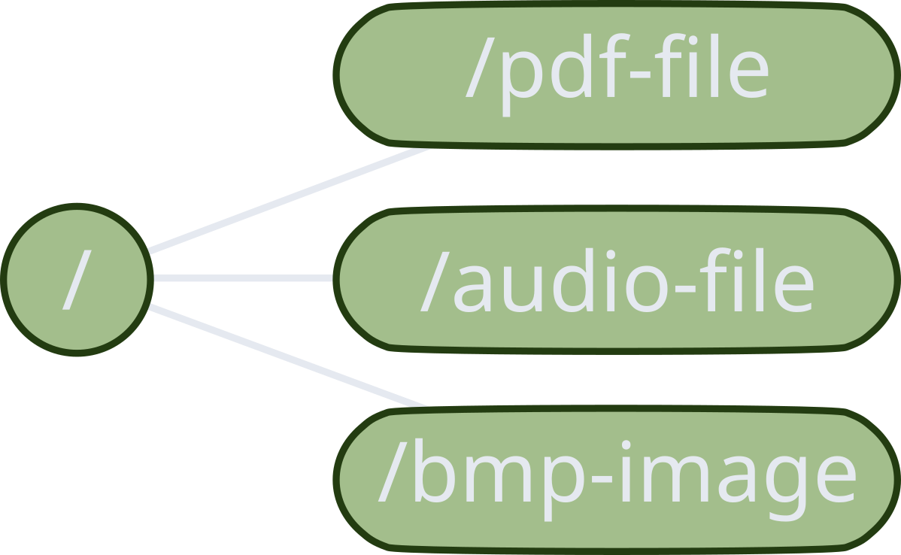
]
]

---

# Graph Algorithms

.large[
- Depth-First Search/Breadth-First Search
- Dijkstra's Algorithm/A* Pathfinding
- Topological Sort
- Eulerian Circuit
- Kruskal's/Prim's Algorithms (MST)
- Kosaraju's Algorithm (SCC)
]

???

We won't go over all these algorithms, each one could be a talk on its own. Instead, the take-home message here is that by using graph data structures and algorithms, you can solve a variety of problems related to connected systems (like, you know, the internet, a web page, a friend group, etc.). For example, if you wanted to know how many clicks it would take a user to navigate from any arbitrary page on your site to another, that's a graph problem. If you want to check if there
are any pages that _can't_ navigate to a certain page without the user needing to visit the home screen, that's a graph problem too.

---

# Why Types are Cool

.huge[
- Safer code (fewer tests)
- More self-documenting code
- Fewer errors (at run time)
- Faster code (even JavaScript)
- More ergonomic immutability (thus, thread-safety)
]

???

I will not argue that TypeScript is the best language for this. Honestly, if you're looking for a frontend language that really leverages types to the fullest, I'd recommend something like Elm, PureScript, or ReasonML. But, TypeScript looks enough like JavaScript that it made sense to use it as the example language in this talk. 

---

class: center, middle
background-image: url(img/monkey-riding-dog.jpg)

.dark-bubble[
# Types give you more tools!
]

---

# Representing state with Types

.height2.scaled[

]

???

source - https://fluentforms.com/forms/website-feedback/

---

# Representing state with Types

.flex[
.flex2.height2.scaled[

]

.flex2[
```javascript
formData = {
  fullName: "Frank Smith",
  emailAddress: "fsmith@gmail.com",
  firstTimeVisiting: true,
  primaryReasonForVisiting: "This form!",
  didYouFindWhatYouNeeded: "Yes, all of it",
  userFriendliness: 4
}
```
]
]

---

# Representing state with Types

.flex[
.flex2.height2.scaled[

]

.flex2[
```JavaScript
formData = {
  fullName: "Frank Smith",
  emailAddress: "fsmith@gmail.com",
  firstTimeVisiting: true,
  primaryReasonForVisiting: "This form!",
  didYouFindWhatYouNeeded: "Yes, all of it",
  userFriendliness: 4
}
```

```
Object {
  fullName,
  emailAddress,
  firstTimeVisiting,
  primaryReasonForVisiting,
  didYouFindWhatYouNeeded,
  userFriendliness
}
```
]
]

---

# Representing state with Types

.flex[
.flex2.height2.scaled[

]

.flex2[
```JavaScript
formData = {
  fullName: "Frank Smith",
  emailAddress: "fsmith@gmail.com",
  firstTimeVisiting: true,
  primaryReasonForVisiting: "This form!",
  didYouFindWhatYouNeeded: "Yes, all of it",
  userFriendliness: 4
}
```

```
Object {
  fullName,
  emailAddress,
  firstTimeVisiting,
  primaryReasonForVisiting,
  didYouFindWhatYouNeeded,
  userFriendliness
}
```

- What if a required field is missing?
- What if the email is malformed?
- What if the DB representation is different?
- _Can we represent impossible states?_

.footnote.small[[Making Impossible States Impossible](https://www.youtube.com/watch?v=IcgmSRJHu_8)]
]
]

???

Let's consider some artificial "boundaries" for the code that would interact with this form, which is typically where static typing is the most useful. From the user side, we can think about what happens if one of these "required" fields is left off, or if the email address is nothing like a real email address, or what's going into the text area is SQL injection code, or someone checks multiple of those check boxes, and so on. From the database side, what happens if the DBA decides to
represent empty strings as NULL, or the `firstTime` as a character instead of a proper boolean, or the found indicator as a number instead of the text label? From a more abstract position, without trying to enumerate all the possible pitfalls: is it possible to represent an impossible state using this data model?

---

# Representing state with Types

.flex[
.flex2.height2.scaled[

]

.flex2[
```JavaScript
formData = {
  fullName: "Frank Smith",
  emailAddress: "fsmith@gmail.com",
  firstTimeVisiting: true,
  primaryReasonForVisiting: "This form!",
  didYouFindWhatYouNeeded: "Yes, all of it",
  userFriendliness: 4
}
```
```typescript
type FormEntry = {
  fullName: string,
  emailAddress: string,
  firstTimeVisiting: boolean,
  primaryReasonForVisiting: string?,
  didYouFindWhatYouNeeded: string,
  userFriendliness: number
}
```
]
]

---

# Representing state with Types

.flex[
.flex2.height2.scaled[

]

.flex2[
```typescript
enum foundResponse {
  YesAllOfIt,
  YesSomeOfIt,
  NoNoneOfIt
}

type FormEntry = {
  fullName: string,
  emailAddress: string,
  firstTimeVisiting: boolean,
  primaryReasonForVisiting: string,
  didYouFindWhatYouNeeded: foundResponse,
  userFriendliness: number
}
```
]
]

---

# Representing state with Types

.flex[
.flex2.height2.scaled[

]

.flex2[
```typescript
enum foundResponse {
  YesAllOfIt,
  YesSomeOfIt,
  NoNoneOfIt
}

enum starRating {
  Zero = 0,
  One,
  Two,
  Three,
  Four,
  Five
}

type FormEntry = {
  fullName: string,
  emailAddress: string,
  firstTimeVisiting: boolean,
  primaryReasonForVisiting: string,
  didYouFindWhatYouNeeded: foundResponse,
  userFriendliness: starRating
}
```
]
]

---

# Representing state with Types

.flex[
.flex2.height2.scaled[

]

.flex2[
```typescript
class EmailAddress {
  readonly inner: string;

  constructor(addressString: string) {
    let checkRegex: RegExp = /^\w+@\w+\.\w+$/;
    if (checkRegex.test(addressString)) {
      this.inner = addressString;
    } else {
      throw new Error("Invalid email address!")
    }
  }

  public toString = (): string => this.inner;
}


type FormEntry = {
  fullName: string,
  emailAddress: EmailAddress,
  firstTimeVisiting: boolean,
  primaryReasonForVisiting: string,
  didYouFindWhatYouNeeded: foundResponse,
  userFriendliness: starRating
}
```
]
]

---

# Representing state with Types

.flex[
.flex2.height2.scaled[

]

.flex2.small[
```typescript
class FormEntry {
  readonly fullName: string;
  readonly emailAddress: EmailAddress;
  readonly firstTimeVisiting: boolean;
  readonly primaryReasonForVisiting: string;
  readonly didYouFindWhatYouNeeded: foundResponse;
  readonly userFriendliness: starRating;

  constructor(
    fullName: string, 
    emailAddress: EmailAddress, 
    firstTimeVisiting: boolean, 
    primaryReasonForVisiting: string, 
    didYouFindWhatYouNeeded: foundResponse, 
    userFriendliness: starRating
  ) {
      if (/^\w+(\s+\w+)+/.test(fullName)) {
        this.fullName = fullName;
      } else {
        throw new Error("Invalid full name!");
      }

      this.emailAddress = emailAddress;
      this.firstTimeVisiting = firstTimeVisiting;
      this.primaryReasonForVisiting = primaryReasonForVisiting;
      this.didYouFindWhatYouNeeded = didYouFindWhatYouNeeded;
      this.userFriendliness = userFriendliness;
  }
}
```
]
]

???

You can even have multiple constructors, to produce your desired object type under a variety of circumstances and inputs, but honestly that's a bit more complicated in TypeScript than some other languages. Just know that it's possible.

---

class: center, middle
background-image: url(img/chico-bon-bon.jpeg)

.dark-bubble[
# This is you now
]


---

# Summary

- Carefully considering your data structures will pay off in the short **and** long term.

--

- There are always performance tradeoffs and benefits, being familiar with these will help you choose the right data structure.

--

- Algorithms _depend_ on data structures, not the other way around.

--

- Modeling your data to reflect your mental model of the problem space makes programs easier to reason about and less prone to bugs.

--

- Types are great. (Even if TypeScript is only ok...)

---

class: center, middle
background-image: url(img/thoughtful-ape.jpg)

.dark-bubble[
# Discuss
]


